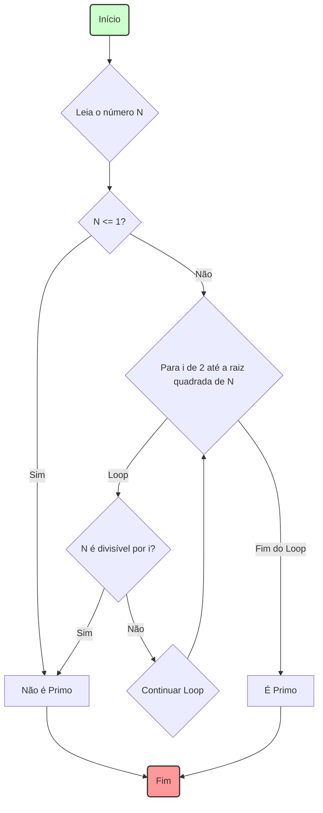

# 🧠 Lógica e Algoritmos: A Essência do Raciocínio Computacional

No coração de toda a Ciência da Computação e de qualquer programa de software estão dois conceitos inseparáveis: **Lógica** e **Algoritmos**. Eles são os blocos de construção fundamentais do raciocínio computacional, permitindo-nos resolver problemas de forma estruturada e eficiente.

### Fundamentos: O Pensamento e a Ação

  - **Lógica de Programação**: É a maneira de organizar o pensamento para resolver um problema. É a base do raciocínio, definindo as regras, condições e o fluxo de passos necessários para se chegar a uma solução. A lógica é o **"como pensar"** de forma sistemática.
  - **Algoritmo**: É a materialização dessa lógica. É a sequência finita, ordenada e não-ambígua de passos que descreve a solução para um problema. O algoritmo é a **"receita do bolo"**, o plano de ação concreto.

Pense em planejar uma viagem: a **lógica** é entender os requisitos (destino, orçamento, datas) e organizar a sequência de tarefas (comprar passagens, reservar hotel, fazer as malas). O **algoritmo** é o itinerário final, detalhado, que você escreve e segue.

-----

## 💡 A Lógica: Construindo o Raciocínio

A lógica de programação nos fornece as ferramentas para estruturar o fluxo de um programa.

### Lógica Proposicional e Booleana

É a base de toda a decisão em um computador. Ela trabalha com proposições que podem ser apenas **VERDADEIRAS** ou **FALSAS**. As operações são feitas com os operadores lógicos:

  - **E (AND)**: Verdadeiro apenas se *ambas* as condições forem verdadeiras.
  - **OU (OR)**: Verdadeiro se *pelo menos uma* das condições for verdadeira.
  - **NÃO (NOT)**: Inverte o valor lógico (verdadeiro vira falso, e vice-versa).

### Estruturas Condicionais

Permitem que um programa tome decisões e siga por caminhos diferentes com base em condições lógicas.

  - **SE (IF)**: Executa um bloco de código se uma condição for verdadeira.
  - **SENÃO (ELSE)**: Executa um bloco de código se a condição do `IF` for falsa.
  - **SENÃO SE (ELSE IF)**: Permite testar múltiplas condições em sequência.

### Estruturas de Repetição (Loops)

Permitem que um bloco de código seja executado repetidamente, evitando a duplicação de código.

  - **ENQUANTO (WHILE)**: Repete um bloco de código *enquanto* uma condição for verdadeira.
  - **PARA (FOR)**: Repete um bloco de código um número predefinido de vezes.

-----

## 📜 Os Algoritmos: A Receita para a Solução

Um algoritmo é a formalização da lógica em um plano de ação executável.

### Características de um Bom Algoritmo

  - **Finito**: Deve sempre terminar após um número finito de passos.
  - **Bem Definido**: Cada passo deve ser preciso e sem ambiguidade.
  - **Efetivo**: Cada passo deve ser simples o suficiente para ser executado.
  - **Entrada e Saída**: Deve ter zero ou mais entradas bem definidas e uma ou mais saídas bem definidas.
  - **Correto**: Deve produzir a saída correta para todo conjunto de entradas válidas.

### Formas de Representação

Antes de codificar, os algoritmos são frequentemente planejados usando:

  - **Linguagem Natural**: Uma descrição passo a passo em português (ou outra língua). Simples, mas pode ser ambíguo.
  - **Fluxograma (Flowchart)**: Uma representação gráfica do fluxo lógico do algoritmo, usando símbolos padronizados. Ótimo para visualização.
  - **Pseudocódigo**: Uma descrição textual que se assemelha a uma linguagem de programação, mas é mais flexível e legível. É a forma mais comum usada por desenvolvedores.

-----

## flowchart Desenhando a Lógica: O Fluxograma

Um fluxograma é uma excelente maneira de visualizar o fluxo de um algoritmo. Abaixo está um fluxograma para um algoritmo que verifica se um número inteiro é primo.



-----

## ⌨️ Da Lógica ao Código: Um Exemplo Prático

Vamos transformar o algoritmo de verificação de número primo em código, seguindo os passos.

**1. Lógica em Linguagem Natural**
Para saber se um número N é primo, precisamos verificar se ele é divisível por algum número entre 2 e sua raiz quadrada. Se encontrarmos algum divisor nesse intervalo, ele não é primo. Se o loop terminar sem encontrar nenhum divisor, ele é primo. Números menores ou iguais a 1 não são primos.

**2. Representação em Pseudocódigo**

```pseudocode
FUNÇÃO eh_primo(N)
    SE N <= 1 ENTÃO
        RETORNE FALSO
    FIM SE

    PARA i DE 2 ATÉ RAIZ_QUADRADA(N)
        SE N % i == 0 ENTÃO
            RETORNE FALSO
        FIM SE
    FIM PARA

    RETORNE VERDADEIRO
FIM FUNÇÃO
```

**3. Implementação (Exemplo em Python)**

```python
import math

def eh_primo(n):
    """
    Verifica se um número é primo.
    """
    if n <= 1:
        return False
    
    # Percorre de 2 até a raiz quadrada de n
    for i in range(2, int(math.sqrt(n)) + 1):
        # Se n for divisível por i, não é primo
        if n % i == 0:
            return False
            
    # Se o loop terminar, o número é primo
    return True

# Testando a função
numero = 29
if eh_primo(numero):
    print(f"O número {numero} é primo.")
else:
    print(f"O número {numero} não é primo.")
```

-----

## 📈 Análise de Algoritmos

Desenvolver um algoritmo que funciona é apenas metade da batalha. A outra metade é garantir que ele seja **eficiente**. A análise de algoritmos estuda o desempenho de um algoritmo, principalmente em relação a:

  - **Complexidade de Tempo**: Quanto tempo o algoritmo leva para ser executado à medida que o tamanho da entrada aumenta.
  - **Complexidade de Espaço**: Quanta memória o algoritmo consome à medida que o tamanho da entrada aumenta.

Essa análise é formalizada usando a **Notação Big O**, que nos permite classificar e comparar algoritmos para escolher a solução mais performática para um problema. A lógica correta combinada com um algoritmo eficiente é a marca de um software de alta qualidade.
