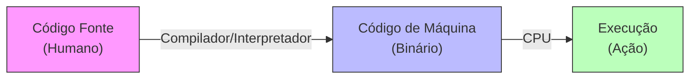

# Aula 02 - Ambiente e Ferramentas 🛠️

!!! tip "Objetivo"
    **Objetivo**: Configurar sua "bancada de trabalho". Vamos conhecer onde os códigos são escritos, compilados e executados.

---

## 1. O Ciclo de Vida do Código 🔄

Você escreve texto, mas o computador entende energia (0 e 1). Como essa mágica acontece?



1.  **Código Fonte**: O que você escreve (ex: `escreva("Olá")`).
2.  **Compilador**: O tradutor.
3.  **Binário**: O executável (`.exe`).

---

## 2. Ferramentas de Aprendizado (Low Code) 🧩

Para começar sem frustração, usamos ferramentas que focam 100% na lógica.

### VisualG & Portugol Studio
Usam **Pseudocódigo** (Português Estruturado). É como programar em português.

**Exemplo no VisualG**:
```portugol
Algoritmo "Exemplo"
Var
   nome : caractere
Inicio
   escreva("Qual seu nome? ")
   leia(nome)
   escreva("Olá, ", nome)
Fimalgoritmo
```

### Scratch
Lógica em blocos. Perfeito para entender estruturas sem erro de sintaxe.
!!! note
    Acesse [scratch.mit.edu](https://scratch.mit.edu) para criar conta.

---

## 3. Visual Studio Code (VS Code) 💻

O editor profissional mais usado do mundo. Ele não faz nada sozinho, mas com **Extensões**, faz tudo.

### Simulando o Terminal (Termynal)
Quando programamos ferramentas "reais" (C, Python, Java), usamos muito o terminal (tela preta).

```console
$ code .
> Abrindo VS Code...

$ gcc programa.c -o programa
> Compilando... Sucesso!

$ ./programa
Olá, Mundo!
```

---

## 4. Guia de Instalação Rápida ⚡

Preparamos guias detalhados para cada ferramenta. Salve estes links:

*   [Configurar VisualG / Portugol](../setups/setup-01.md) 🟢
*   [Configurar Code::Blocks (C/C++)](../setups/setup-02.md) 🧱
*   [Configurar VS Code (Web/Geral)](../setups/setup-03.md) 🌐

---

## 5. Exercícios de Configuração 📝

1.  **Fácil**: Baixe o **VisualG** (ou Portugol Studio) e execute o algoritmo "Olá Mundo".
2.  **Médio**: Crie uma conta no **Scratch** e explore os blocos de "Eventos".
3.  **Desafio**: Instale o **VS Code**, instale a extensão "Draw.io Integration" e tente desenhar um fluxograma dentro do próprio VS Code!

---
**Próxima Aula**: Agora sim, código! Vamos para a [Estrutura Sequencial](./aula-03.md).