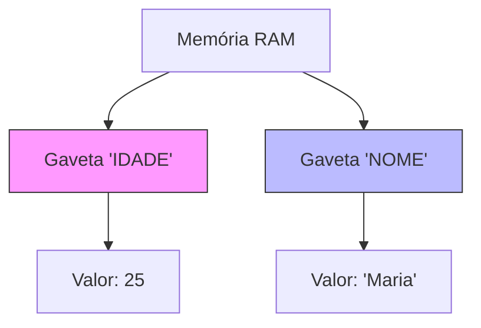

# Aula 03 - Estrutura Sequencial ➡️

!!! tip "Objetivo"
    **Objetivo**: Entender como o computador guarda informações (Variáveis) e executa comandos um após o outro.

---

## 1. Variáveis: As Caixas da Memória 📦

Imagine que a memória RAM do computador é um grande **armário cheio de gavetas**. Cada gaveta tem um endereço e guarda **uma coisa** por vez.

### Visualizando a Memória (Mermaid)



---

## 2. Tipos de Dados (O Formato da Caixa) 📐

Nem tudo cabe na mesma gaveta. Precisamos definir o **TIPO** da variável.

| Tipo (Pseudocódigo) | O que guarda? | Exemplo | Tamanho (Bytes) |
| :--- | :--- | :--- | :---: |
| **Inteiro** | Números sem vírgula | `10`, `-5`, `0` | 4 |
| **Real** | Números com vírgula | `10.5`, `3.14` | 8 |
| **Caractere** | Texto (Letras/Palavras) | `"Olá"`, `'A'` | Var |
| **Lógico** | Verdadeiro ou Falso | `VERDADEIRO` | 1 |

!!! warning "Erro Comum"
    **Erro Comum**: Tentar guardar texto numa variável numérica gera erro! `inteiro x = "texto"` ❌

---

## 3. Entrada, Processamento e Saída ⚙️

Todo algoritmo segue esse fluxo:

1.  **Entrada (Input)**: Dados que chegam (Teclado, Arquivo).
2.  **Processamento**: Cálculos (`soma = a + b`).
3.  **Saída (Output)**: Resultado (Tela).

### Exemplo: Calculadora de Dobro (VisualG)

```portugol
Algoritmo "Dobro"
Var
   num, resultado : inteiro
Inicio
   // Entrada
   escreva("Digite um número: ")
   leia(num)
   
   // Processamento
   resultado <- num * 2
   
   // Saída
   escreva("O dobro é: ", resultado)
Fimalgoritmo
```

### Simulando a Execução (Termynal)

<div data-termynal class="termy">
    <span data-ty="input">./calcula_dobro</span>
    <span data-ty>Digite um número: 5</span>
    <span data-ty="progress">O dobro é: 10</span>
</div>

---

## 4. Exercícios de Fixação 📝

1.  **Fácil**: Crie um algoritmo que leia o **Nome** e **Idade** de, pessoa e mostre: "Olá [Nome], você tem [Idade] anos".
2.  **Médio**: Leia dois números (A e B) e troque seus valores (A vira B, B vira A). *Dica: Use uma variável auxiliar.*
3.  **Desafio**: Um motorista deseja encher o tanque. Leia o preço da gasolina e o valor que ele tem em dinheiro. Calcule quantos litros ele consegue colocar.

---
**Próxima Aula**: E se precisarmos tomar decisões? [Estrutura Condicional](./aula-04.md).