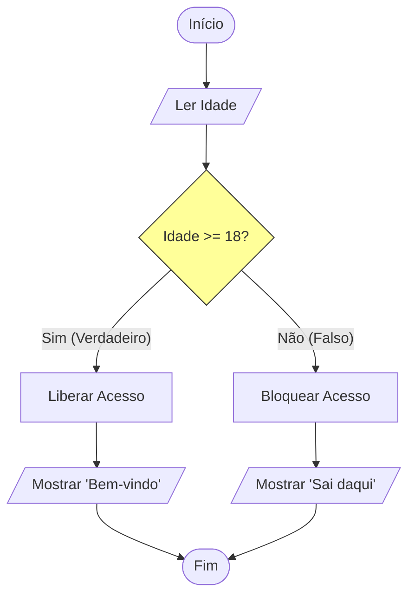

# Aula 04 - Estrutura Condicional 🔀

!!! tip "Objetivo"
    **Objetivo**: Ensinar o computador a tomar decisões baseadas em perguntas (Se/Então).

---

## 1. O Desvio Lógico ("Se...") 🤔

Até agora, nossos programas eram uma linha reta. Mas a vida é cheia de "Se":
*   **SE** chover, levo guarda-chuva.
*   **SENÃO**, vou de óculos escuros.

### Visualizando a Decisão (Mermaid)



---

## 2. Sintaxe Básica (Se-Entao-Senao) 📝

Em Portugol, a estrutura é muito legível.

```portugol
se (idade >= 18) entao
   escreva("Maior de idade")
senao
   escreva("Menor de idade")
fimse
```

### Operadores Relacionais (A Pergunta)
Para fazer a pergunta dentro do `se`, usamos comparadores:

| Símbolo | Significado | Exemplo | Resultado |
| :---: | :--- | :--- | :--- |
| `>` | Maior que | `10 > 5` | Verdadeiro |
| `<` | Menor que | `5 < 10` | Verdadeiro |
| `==` | Igual a | `5 == 5` | Verdadeiro |
| `!=` | Diferente | `5 != 3` | Verdadeiro |
| `>=` | Maior ou Igual | `10 >= 10` | Verdadeiro |

---

## 3. Múltiplas Escolhas (Switch/Caso) 🚦

Quando temos muitas opções fixas (Menu), usar vários `se` fica feio. Usamos a estrutura **Escolha-Caso**.

```portugol
escolha (opcao)
   caso 1
      escreva("Ligando...")
   caso 2
      escreva("Reiniciando...")
   caso 3
      escreva("Sair")
   outrocaso
      escreva("Opção Inválida")
fimescolha
```

### Simulando um Menu (Termynal)

```console
$ ./menu_sistema
1. Iniciar
2. Configurações
3. Sair
Digite sua opção: 2
> Abrindo Configurações...
```

---

## 4. Exercícios de Fixação 📝

1.  **Fácil (Par ou Ímpar)**: Leia um número inteiro. Se o resto da divisão por 2 for 0 (`num % 2 == 0`), escreva PAR, senão, ÍMPAR.
2.  **Médio (Média)**: Leia 2 notas. Calcule a média.
    *   Se média >= 7: APROVADO.
    *   Se média >= 5 e < 7: RECUPERAÇÃO.
    *   Se média < 5: REPROVADO.
3.  **Desafio (Bhaskara)**: Leia A, B e C. Calcule o Delta (`B*B - 4*A*C`).
    *   Se Delta < 0: Não existe raiz real.
    *   Se Delta >= 0: Calcule e mostre X1 e X2.

---
**Próxima Aula**: Como repetir uma tarefa 1000 vezes sem escrever 1000 linhas? [Estruturas Repetitivas](./aula-05.md).