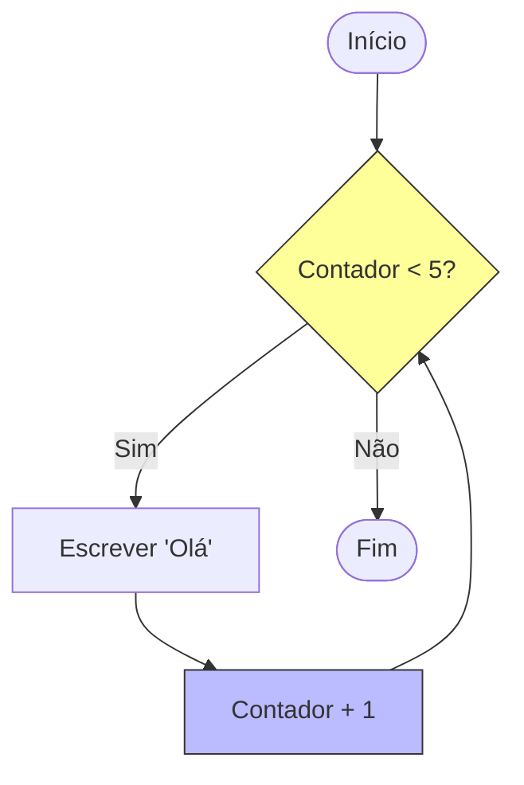

# Aula 05 - Estruturas Repetitivas 🔁

!!! tip "Objetivo"
    **Objetivo**: Aprender a automatizar tarefas repetitivas. Se você precisa fazer algo mais de uma vez, use um laço (loop).

---

## 1. O Poder da Repetição 🔄

Imagine ter que escrever `escreva("Oi")` mil vezes. Inviável, certo?
As estruturas de repetição permitem executar um bloco de código várias vezes **enquanto** uma condição for verdadeira.

### Visualizando o Loop (Mermaid)



---

## 2. Enquanto (While) ⏳

É o laço mais simples. Testa a condição **antes** de executar. Se a condição for falsa logo de cara, ele nem entra.

```portugol
i <- 0
enquanto (i < 5) faca
   escreva("Contagem: ", i)
   i <- i + 1
fimenquanto
```

### Simulando (Termynal)

```console
$ ./contagem
Contagem: 0
Contagem: 1
Contagem: 2
Contagem: 3
Contagem: 4
```

---

## 3. Repita-Até (Do-While) 🛡️

Executa **pelo menos uma vez**, pois testa a condição no **final**.
Útil para menus ou validação de entrada (ex: "Digite a senha correta").

```portugol
repita
   escreva("Digite a senha: ")
   leia(senha)
ate (senha == "1234")
```

---

## 4. Para (For) 🎯

O melhor para quando você sabe **exatamente** quantas vezes quer repetir (ex: 10 vezes, do dia 1 ao 30).
Ele agrupa **Inicialização**, **Condição** e **Incremento** em uma linha só.

```portugol
// De 1 até 10, de 1 em 1
para i de 1 ate 10 passo 1 faca
   escreva(i)
fimpara
```

---

## 5. Exercícios de Fixação 📝

1.  **Fácil (Contagem Regressiva)**: Faça um algoritmo que conte de 10 até 0 e escreva "FOGO!".
2.  **Médio (Tabuada)**: Leia um número (ex: 7) e mostre sua tabuada do 1 ao 10.
3.  **Desafio (Números Primos)**: Leia um número e diga se ele é primo (divisível apenas por 1 e por ele mesmo).

---
**Próxima Aula**: Como guardar 100 nomes sem criar 100 variáveis? [Vetores (Arrays)](./aula-06.md).