# Aula 05 - Estruturas Repetitivas 🔁

!!! tip "Objetivo"
    **Objetivo**: Aprender a automatizar tarefas repetitivas. Se você precisa fazer algo mais de uma vez, use um laço (loop).

---

## 1. O Poder da Repetição 🔄

Imagine ter que escrever `escreva("Oi")` mil vezes. Inviável, certo?
As estruturas de repetição permitem executar um bloco de código várias vezes **enquanto** uma condição for verdadeira.

### Visualizando o Loop (Mermaid)

```mermaid
graph TD;
    Inicio([Início]) --> Cond{Contador < 5?};
    Cond -- Sim --> Acao["Escrever 'Olá'"];
    Acao --> Inc[Contador + 1];
    Inc --> Cond;
    Cond -- Não --> Fim([Fim]);
    
    style Cond fill:#ff9,stroke:#333;
    style Inc fill:#bbf,stroke:#333;
```



---

## 2. Enquanto (While) ⏳

É o laço mais simples. Testa a condição **antes** de executar. Se a condição for falsa logo de cara, ele nem entra.

```portugol
i <- 0
enquanto (i < 5) faca
   escreva("Contagem: ", i)
   i <- i + 1
fimenquanto
```

### Simulando (Termynal)

<div data-termynal class="termy">
    <span data-ty="input">./contagem</span>
    <span data-ty>Contagem: 0</span>
    <span data-ty>Contagem: 1</span>
    <span data-ty>Contagem: 2</span>
    <span data-ty>Contagem: 3</span>
    <span data-ty>Contagem: 4</span>
</div>

---

## 3. Repita-Até (Do-While) 🛡️

Executa **pelo menos uma vez**, pois testa a condição no **final**.
Útil para menus ou validação de entrada (ex: "Digite a senha correta").

```portugol
repita
   escreva("Digite a senha: ")
   leia(senha)
ate (senha == "1234")
```

---

## 4. Para (For) 🎯

O melhor para quando você sabe **exatamente** quantas vezes quer repetir (ex: 10 vezes, do dia 1 ao 30).
Ele agrupa **Inicialização**, **Condição** e **Incremento** em uma linha só.

```portugol
// De 1 até 10, de 1 em 1
para i de 1 ate 10 passo 1 faca
   escreva(i)
fimpara
```

---

## 5. Controle de Fluxo (Interrompa) 🛑

Às vezes, precisamos sair do loop antes da hora (ex: achamos o que procurávamos).
No VisualG, usamos o comando `interrompa`.

```portugol
enquanto (verdadeiro) faca
   escreva("Digite 0 para sair: ")
   leia(num)
   se (num == 0) entao
       interrompa
   fimse
fimenquanto
```

---

## 6. O Teste de Mesa (Debug Mental) 🧠

Como saber se o loop está certo? Fazemos uma tabela simulando as variáveis passo a passo.
Exemplo: Contador de 1 a 3.

| Passo | Variável `i` | Condição `i <= 3`? | Ação |
| :---: | :---: | :---: | :--- |
| 1 | 1 | Sim (Verdadeiro) | Escreve "1" |
| 2 | 2 | Sim (Verdadeiro) | Escreve "2" |
| 3 | 3 | Sim (Verdadeiro) | Escreve "3" |
| 4 | 4 | **Não (Falso)** | **Para!** |

---

## 7. Exercícios de Fixação 📝

1.  **Fácil (Contagem Regressiva)**: Faça um algoritmo que conte de 10 até 0 e escreva "FOGO!".
2.  **Médio (Tabuada)**: Leia um número (ex: 7) e mostre sua tabuada do 1 ao 10.
3.  **Desafio (Números Primos)**: Leia um número e diga se ele é primo (divisível apenas por 1 e por ele mesmo).
    ??? tip "Dica: Primos"
        Um número Primo só tem 2 divisores. Use um laço de 1 até Ele Mesmo e conte quantos divisores existem. Se o contador for 2, é Primo!

---
**Próxima Aula**: Como guardar 100 nomes sem criar 100 variáveis? [Vetores (Arrays)](./aula-06.md).