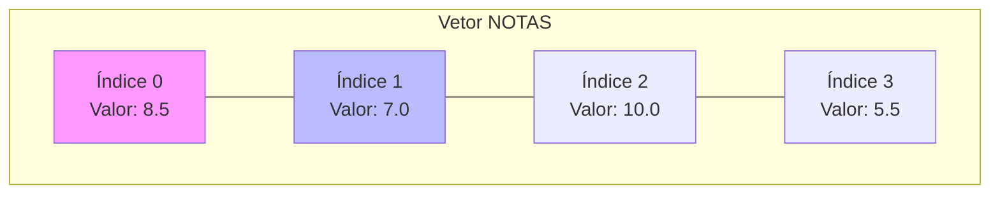

# Aula 06 - Estruturas de Dados I: Vetores 📊

!!! tip "Objetivo"
    **Objetivo**: Aprender a guardar múltiplos dados do mesmo tipo em uma única variável "comprida".

---

## 1. O Problema das Muitas Variáveis 😫

Imagine guardar a nota de 50 alunos.
`nota1`, `nota2`, `nota3`... `nota50`.
E para calcular a média? `(nota1 + nota2 + ... + nota50) / 50`.
Isso é caótico. Para isso existem os **Vetores (Arrays)**.

---

## 2. O Que é um Vetor? 📏

Um vetor é como uma **suqueira de remédios** ou uma **planilha de uma linha só**.
Ele tem um **Nome**, um **Tamanho** e posições numeradas (Índices).

### Visualizando um Vetor (Mermaid)



!!! warning "Atenção"
    **Atenção**: Na maioria das linguagens (C, Java, Python), o primeiro índice é **0**, não 1!

---

## 3. Manipulando Vetores 🛠️

Em Portugol, a sintaxe é simples.

### Declaração
```portugol
nomes : vetor [0..4] de caractere
```

### Acesso (Ler e Escrever)
```portugol
nomes[0] <- "Ana"
escreva(nomes[0]) // Escreve "Ana"
```

### Percorrendo com 'Para'
A combinação perfeita: Vetor + Loop `Para`.

```portugol
para i de 0 ate 4 faca
   escreva("Digite o nome ", i, ": ")
   leia(nomes[i])
fimpara
```

### Simulando (Termynal)

```termynal
$ ./lista_nomes
Digite o nome 0: Ana
Digite o nome 1: Carlos
Digite o nome 2: Bia
...
```

---

## 4. Exercícios de Fixação 📝

1.  **Fácil**: Crie um vetor de 5 números inteiros. Preencha-o e depois mostre a soma de todos eles.
2.  **Médio (Inverso)**: Leia 10 números e mostre-os na ordem inversa (do último para o primeiro).
3.  **Desafio (Maior/Menor)**: Leia 10 números. No final, diga qual foi o **Maior** valor digitado e em qual **posição** ele está.

---
**Próxima Aula**: E se precisarmos de linhas E colunas? [Matrizes](./aula-07.md).