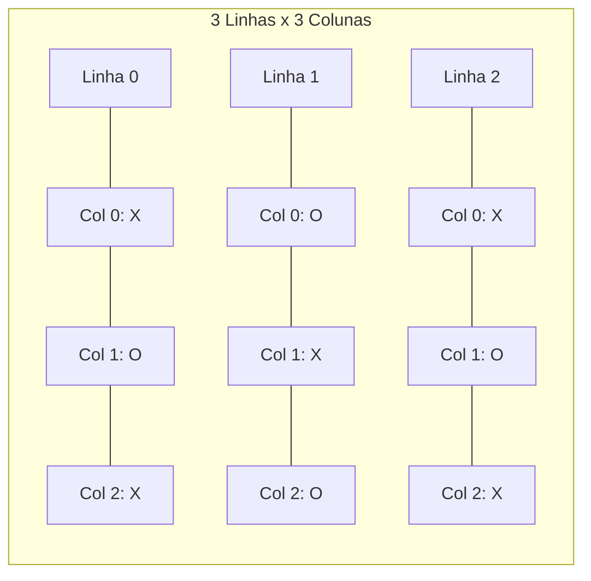

# Aula 07 - Estruturas de Dados II: Matrizes 📈

!!! tip "Objetivo"
    **Objetivo**: Expandir o conceito de vetor para duas dimensões. Pense em uma planilha do Excel ou um tabuleiro de Xadrez.

---

## 1. O Mundo em 2D 🗺️

Nem tudo é uma lista simples. Um cinema tem fileiras e cadeiras. Uma planilha tem linhas e colunas.
Para isso, usamos **Matrizes** (Vetores de Vetores).

### Visualizando uma Matriz (Mermaid)



---

## 2. Coordenadas (Linha, Coluna) 📍

Para achar alguém no cinema, você precisa de duas informações: "Fileira F, Cadeira 12".
Na matriz é igual: `matriz[linha][coluna]`.

```portugol
// Declaração: Matriz de 3 linhas e 3 colunas
matriz : vetor [0..2, 0..2] de inteiro

// Acessando o centro
matriz[1][1] <- 50
```

---

## 3. Percorrendo uma Matriz 🔄🔄

Se um vetor precisa de 1 loop, uma matriz precisa de **2 loops aninhados** (um dentro do outro).

```portugol
para linha de 0 ate 2 faca
   para coluna de 0 ate 2 faca
      escreva("Digite valor para [", linha, ",", coluna, "]: ")
      leia(matriz[linha][coluna])
   fimpara
fimpara
```

### Simulando a Execução (Termynal)

```console
$ ./preenche_matriz
Digite valor para [0,0]: 10
Digite valor para [0,1]: 20
Digite valor para [0,2]: 30
Digite valor para [1,0]: 40...
```

---

## 4. Exercícios de Fixação 📝

1.  **Fácil (Identidade)**: Crie uma matriz 3x3 onde a diagonal principal (0,0 | 1,1 | 2,2) seja preenchida com 1 e o resto com 0.
2.  **Médio (Soma)**: Leia uma matriz 2x2 e mostre a soma de todos os seus elementos.
3.  **Desafio (Batalha Naval)**: Crie um tabuleiro 5x5 zerado. Esconda um "Navio" (valor 1) em uma posição aleatória. Peça para o usuário "atirar" (digitar linha e coluna). Se acertar, escreva "FOGO!", senão, "ÁGUA".

---
**Próxima Aula**: Como organizar códigos gigantes sem perder a cabeça? [Modularização e Funções](./aula-08.md).