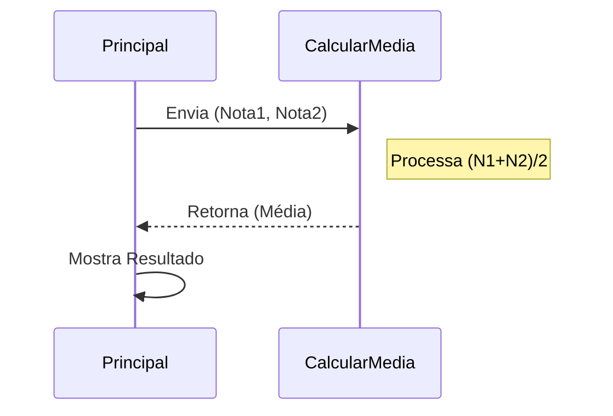

# Aula 08 - Modularização: Funções e Procedimentos 🧩

!!! tip "Objetivo"
    **Objetivo**: Aprender a dividir um problema grande em pequenos pedaços reutilizáveis. "Dividir para conquistar".

---

## 1. O Que é Modularização? 🧱

Imagine construir um carro. Você não faz o motor, os pneus e o vidro ao mesmo tempo num bloco só. Você monta peças separadas e as encaixa.
**Funções** são essas peças.

### Visualizando a Chamada (Mermaid)



---

## 2. Tipos de Módulos 🛠️

Em Portugol (e muitas linguagens), temos dois tipos:

### Procedimento (Sem Retorno)
Faz uma ação e não devolve número matemático. Ex: `LimparTela()`, `MostrarMenu()`.

```portugol
procedimento saudacao(nome : caractere)
Inicio
   escreva("Olá, ", nome, "!")
fimprocedimento
```

### Função (Com Retorno)
Calcula algo e devolve uma resposta. Ex: `RaizQuadrada(x)`, `Soma(a, b)`.

```portugol
funcao somar(a, b : inteiro) : inteiro
Inicio
   retorne a + b
fimfuncao
```

---

## 3. Escopo de Variáveis (Onde ela vive?) 🏠

Isso é CRÍTICO.
*   **Variável Global**: Todo mundo vê. (Perigoso!)
*   **Variável Local**: Só existe dentro da função. (Seguro)

!!! warning
    Se você criar uma variável `x` dentro da função `somar`, o programa principal **NÃO** enxerga ela.

---

## 4. Simulando (Termynal)

```console
$ ./sistema_bancario
--- MENU ---
1. Saldo
2. Saque
Digite opcao: 2
CHAMANDO FUNCAO SAQUE...
Saque realizado!
RETORNANDO AO MENU...
```

---

## 5. Exercícios de Fixação 📝

1.  **Fácil**: Crie um procedimento `DesenharLinha()` que escreva "----------" na tela. Use-o para separar títulos.
2.  **Médio**: Crie uma função `ConverterParaFahrenheit(celsius)` que recebe o valor em C e retorna em F.
3.  **Desafio (Calculadora)**: Crie funções para `Somar`, `Subtrair`, `Multiplicar` e `Dividir`. No programa principal, peça dois números e a operação desejada, chamando a função correta.

---
**Próxima Aula**: Fim dos Fundamentos! Agora vamos aplicar tudo isso em linguagens reais, começando pelos pais da programação: [C e C++](./aula-09.md).