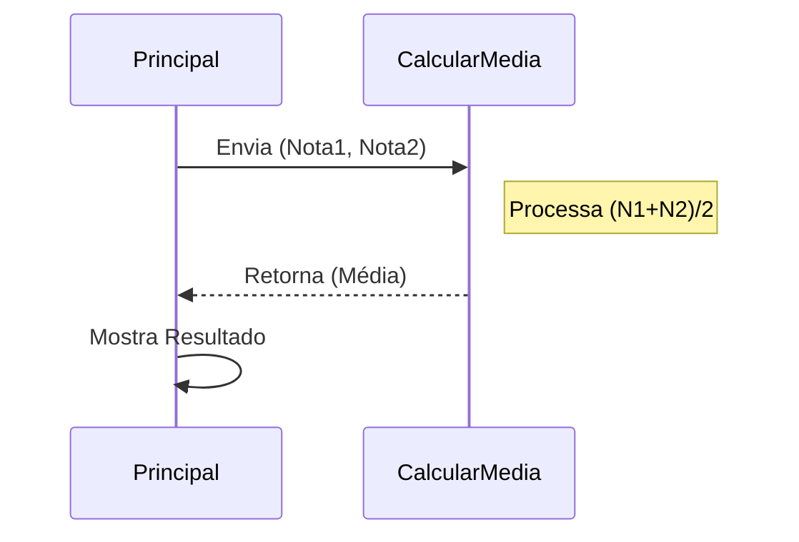

# Aula 08 - Modularização: Funções e Procedimentos 🧩

!!! tip "Objetivo"
    **Objetivo**: Aprender a dividir um problema grande em pequenos pedaços reutilizáveis. "Dividir para conquistar".

---

## 1. O Que é Modularização? 🧱

Imagine construir um carro. Você não faz o motor, os pneus e o vidro ao mesmo tempo num bloco só. Você monta peças separadas e as encaixa.
**Funções** são essas peças.

### Visualizando a Chamada (Mermaid)



---

## 2. Tipos de Módulos 🛠️

Em Portugol (e muitas linguagens), temos dois tipos:

### Procedimento (Sem Retorno)
Faz uma ação e não devolve número matemático. Ex: `LimparTela()`, `MostrarMenu()`.

```portugol
procedimento saudacao(nome : caractere)
Inicio
   escreva("Olá, ", nome, "!")
fimprocedimento
```

### Função (Com Retorno)
Calcula algo e devolve uma resposta. Ex: `RaizQuadrada(x)`, `Soma(a, b)`.

```portugol
funcao somar(a, b : inteiro) : inteiro
Inicio
   retorne a + b
fimfuncao
```

---

## 3. Escopo de Variáveis (Onde ela vive?) 🏠

Isso é CRÍTICO.
*   **Variável Global**: Todo mundo vê. (Perigoso!)
*   **Variável Local**: Só existe dentro da função. (Seguro)

!!! warning
    Se você criar uma variável `x` dentro da função `somar`, o programa principal **NÃO** enxerga ela.

---

## 3.5 Passagem de Parâmetros (Valor vs Referência) 🚚

Como a função recebe os dados?

1.  **Por Valor (Padrão)**: A função recebe uma **CÓPIA**. Se mudar lá dentro, não afeta fora.
2.  **Por Referência (`var`)**: A função recebe o **ENDEREÇO** da variável original. Se mudar lá dentro, muda fora também!

```portugol
// Exemplo: Trocar valor (Precisa ser referência!)
procedimento trocar(var a, var b : inteiro)
   // ... código de troca ...
fimprocedimento
```

---

## 4. Recursividade: A Função que se Chama 🔄

Uma função é **recursiva** quando ela chama a si mesma para resolver um problema menor.
Imagine uma boneca russa (Matrioshka): para abrir a maior, você precisa abrir a que está dentro, até chegar na última.

### Exemplo: Fatorial de um Número
$5! = 5 \times 4 \times 3 \times 2 \times 1$

```portugol
funcao fatorial(n : inteiro) : inteiro
Inicio
   // Condição de Parada (Base)
   se (n == 0) entao
      retorne 1
   senao
      // Chamada Recursiva
      retorne n * fatorial(n - 1)
   fimse
fimfuncao
```

### 4.5 A Pilha de Chamadas (Call Stack) 📚
Quando uma função chama outra (ou a si mesma), o computador empilha essas chamadas.
1. `fatorial(3)` chama...
2. `fatorial(2)` que chama...
3. `fatorial(1)` que chama...
4. `fatorial(0)` -> Retorna 1!
Agora a pilha começa a "desempilhar" multiplicando os resultados.

!!! danger "Estouro de Pilha (Stack Overflow)"
    Se você esquecer a **Condição de Parada**, a função se chamará infinitamente até travar a memória do computador!

## 4. Simulando (Termynal)

<div data-termynal class="termy">
    <span data-ty="input">./sistema_bancario</span>
    <span data-ty>--- MENU ---</span>
    <span data-ty>1. Saldo</span>
    <span data-ty>2. Saque</span>
    <span data-ty>Digite opcao: 2</span>
    <span data-ty>CHAMANDO FUNCAO SAQUE...</span>
    <span data-ty>Saque realizado!</span>
    <span data-ty>RETORNANDO AO MENU...</span>
</div>

---

## 5. Exercícios de Fixação 📝

1.  **Fácil**: Crie um procedimento `DesenharLinha()` que escreva "----------" na tela. Use-o para separar títulos.
2.  **Médio**: Crie uma função `ConverterParaFahrenheit(celsius)` que recebe o valor em C e retorna em F.
3.  **Desafio (Calculadora)**: Crie funções para `Somar`, `Subtrair`, `Multiplicar` e `Dividir`. No programa principal, peça dois números e a operação desejada, chamando a função correta.
4.  **🏆 PROJETO FINAL MÓDULO 1**: Crie um "Sistema de Notas" que use tudo que aprendeu:
    *   Um vetor para nomes e um vetor para médias.
    *   Um procedimento `LerDados()` para preencher os vetores.
    *   Uma função `VerificarAprovacao(media)` que retorna "Aprovado" ou "Reprovado".
    *   Um loop para mostrar o boletim final de 5 alunos.

---
**Próxima Aula**: Fim dos Fundamentos! Agora vamos aplicar tudo isso em linguagens reais, começando pelos pais da programação: [C e C++](./aula-09.md).