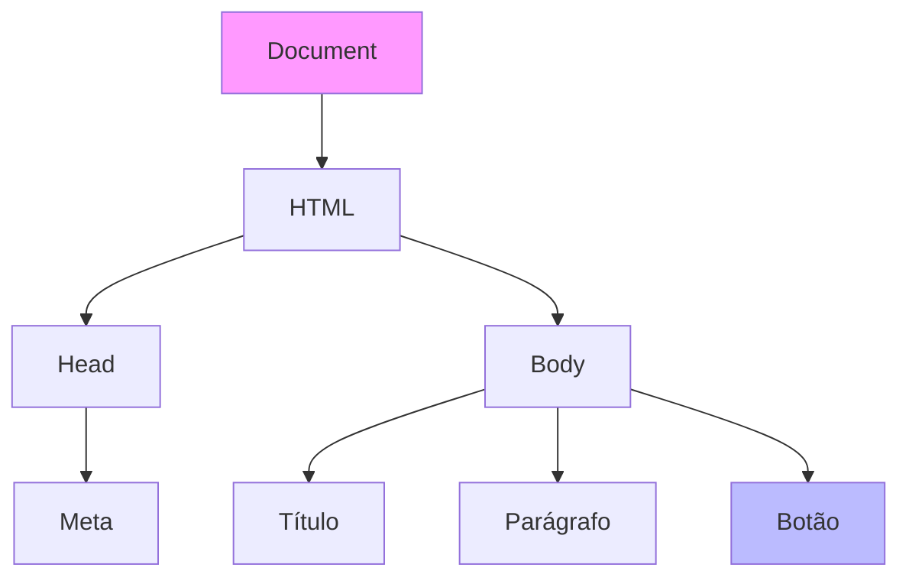

# Aula 10 - Web Moderna: JavaScript e TypeScript 🌐

!!! tip "Objetivo"
    **Objetivo**: Dar vida às páginas web e construir aplicações completas (Frontend e Backend).

---

## 1. O Navegador é o Sistema Operacional 🖥️

O JavaScript (JS) é a única linguagem que roda nativamente em todos os navegadores.
Ele manipula o **DOM** (Document Object Model), que é a estrutura da página HTML.

### Visualizando o DOM (Mermaid)


```mermaid
graph TD;
    Doc[Document] --> HTML;
    HTML --> Head;
    HTML --> Body;
    Head --> Meta;
    Body --> H1[Título];
    Body --> P[Parágrafo];
    Body --> Button[Botão];
    
    style Doc fill:#f9f;
    style Button fill:#bbf;
```

---

## 2. JavaScript: Dinamismo ⚡

```javascript
// Seleciona o botão e adiciona um evento
const botao = document.querySelector('button');

botao.addEventListener('click', () => {
    alert("Você clicou no botão!");
});
```

### Node.js: JS fora do Navegador
Hoje, JS também roda no servidor com o **Node.js**.

```termynal
$ node servidor.js
> Servidor rodando na porta 3000...
```

---

## 3. TypeScript: O JavaScript com Superpoderes 🛡️

O JS é "fracamente tipado" (você pode somar texto com número e ele deixa). O TypeScript (TS) adiciona **Tipagem Estática** para evitar erros bobos.

| Código JS (Suscetível a erro) | Código TS (Seguro) |
| :--- | :--- |
| `function soma(a, b) { return a + b; }` | `function soma(a: number, b: number): number { return a + b; }` |

!!! note
    O navegador não entende TS. Ele precisa ser **transpilado** para JS.

---

## 4. Exercícios de Fixação 📝

1.  **Fácil**: Crie um arquivo HTML com um botão. Use JS para mudar a cor de fundo da página quando clicar nele.
2.  **Médio (Node)**: Crie um script `tabuada.js` que mostre a tabuada do 7 no terminal.
3.  **Desafio (TS)**: Crie uma interface `Pessoa` com nome e idade. Crie uma função que receba um objeto desse tipo e diga se é maior de idade.

---
**Próxima Aula**: O gigante corporativo. Vamos aprender sobre Classes e Objetos robustos com [Java](./aula-11.md).