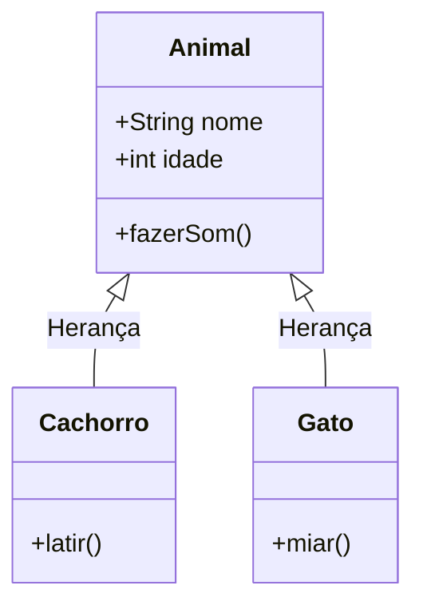

# Aula 11 - Java e Orientação a Objetos ☕

!!! tip "Objetivo"
    **Objetivo**: Entender como organizar sistemas grandes e complexos usando Classes, Objetos e Herança.

---

## 1. O Mundo dos Objetos 🌍

Na programação estruturada (C, Pascal), focamos em **ações** (funções).
Na Orientação a Objetos (OO), focamos em **coisas** (objetos).

*   **Classe**: A forma, o molde (ex: Planta da Casa).
*   **Objeto**: A coisa concreta (ex: A Casa construída).

### Visualizando Classes (Mermaid UML)



---

## 2. Java: "Escreva uma vez, rode em qualquer lugar" ♻️

Java usa uma **Máquina Virtual** (JVM).

```termynal
$ javac OlaMundo.java
> Compilando para Bytecode (.class)...

$ java OlaMundo
Olâ, Mundo Java!
```

---

## 3. Encapsulamento, Herança e Polimorfismo 🛡️

Os 3 pilares da OO em Java:
1.  **Encapsulamento**: Proteger os dados (`private`) e dar acesso controlado (`get/set`).
2.  **Herança**: `Cachorro` **é um** `Animal`. Reaproveita código.
3.  **Polimorfismo**: `Animal` faz som, mas o `Cachorro` late e o `Gato` mia.

### Código Java

```java
public class Animal {
    private String nome; // Encapsulado

    public void fazerSom() {
        System.out.println("Som genérico...");
    }
}

public class Cachorro extends Animal {
    @Override
    public void fazerSom() {
        System.out.println("Au Au!");
    }
}
```

---

## 4. Exercícios de Fixação 📝

1.  **Fácil**: Crie uma classe `Pessoa` com `nome` e `idade`. Crie um método `apresentar()`.
2.  **Médio**: Crie uma classe `ContaBancaria` com `saldo` privado. Crie métodos `depositar(valor)` e `sacar(valor)`. Não deixe o saldo ficar negativo!
3.  **Desafio (Herança)**: Crie uma classe `Funcionario` e uma subclasse `Gerente`. O gerente tem um método extra `autorizarPagamento()`.

---
**Próxima Aula**: O ecossistema da Microsoft. Vamos ver como C# e .NET facilitam a vida do desenvolvedor: [C# e .NET](./aula-12.md).