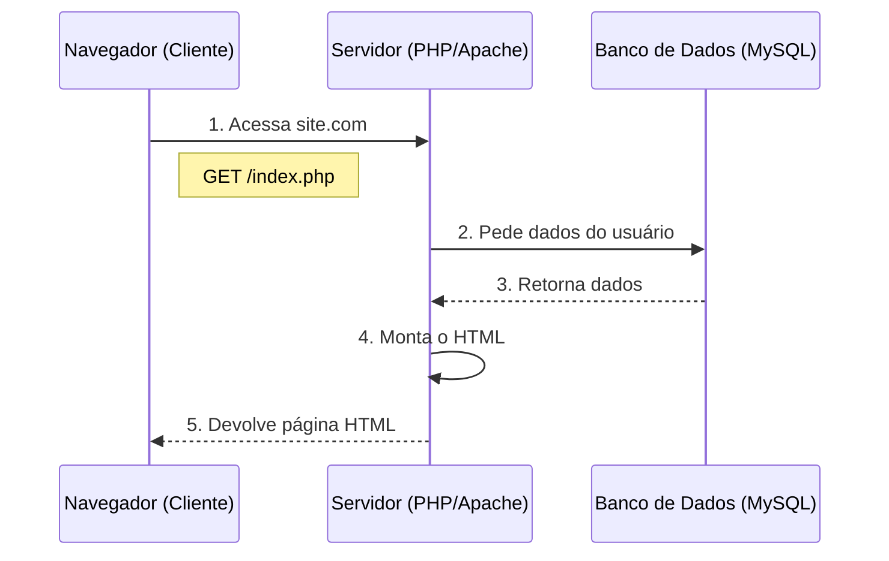

# Aula 16 - PHP e o Legado Web 🐘

> [!TIP]
> **Objetivo**: Entender como a Web funciona de verdade. O ciclo Cliente-Servidor e por que o PHP ainda domina 77% da internet.

---

## 1. O Ciclo da Web (Request/Response) 🌍

Toda vez que você acessa um site, uma conversa acontece.

### Visualizando a Requisição (Mermaid)



---

## 2. PHP: O Motor da Web Dinâmica ⚙️

O PHP roda no **Servidor**. O usuário nunca vê o código PHP, só o HTML que ele gera.

```php
<?php
$nome = "Maria";
echo "<h1>Olá, $nome!</h1>";
?>
```

O navegador recebe apenas:
```html
<h1>Olá, Maria!</h1>
```

### Simulando um Servidor Local (Termynal)

```termynal
$ php -S localhost:8000
> PHP Development Server started...
> Listening on http://localhost:8000
> Press Ctrl-C to quit.
```

---

## 3. Laravel: PHP Moderno 🚀

Ninguém escreve PHP "puro" em grandes sistemas. Usamos frameworks como **Laravel**. Ele organiza tudo em **MVC** (Model, View, Controller).

*   **Model**: Cuida do Banco de Dados.
*   **View**: Cuida do HTML (Telas).
*   **Controller**: O cérebro que liga os dois.

---

## 4. Projeto Final: Mural de Recados 📌

Vamos fechar o curso conectando tudo.
1.  **Banco**: Tabela `recados` (id, texto).
2.  **PHP**: Conecta e busca os recados.
3.  **HTML**: Mostra na tela.

---

## 5. Exercícios de Fixação 📝

1.  **Fácil**: Crie um script PHP que mostre a data e hora atual.
2.  **Médio**: Crie um formulário HTML que envie nome e idade para um script PHP, que deve responder "Pode entrar" ou "Barrado".
3.  **Desafio (SQL + PHP)**: Desenhe o diagrama de como seria o sistema de login do Facebook (Cliente -> Servidor -> Banco).

---
**Parabéns!** 🎓 Você completou o módulo teórico/prático. Agora é hora de botar a mão na massa nos [Projetos Finais](../projetos/index.md)!
