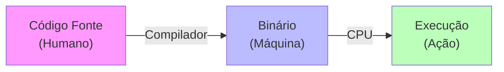

# Aula 02 - Ambiente e Ferramentas 🛠️

---

## Agenda 📅

1.  O Ciclo de Vida do Código
2.  Ferramentas de Aprendizado (Low Code)
3.  Visual Studio Code (A Ferramenta Real)
4.  O Terminal (Sem Medo!)
5.  Instalação e Configuração

---

## 1. O Ciclo de Vida do Código 🔄

Como o computador entende o que escrevemos?

- **Nós**: Falamos Inglês/Português (Texto).
- **Computador**: Fala Energia (0 e 1).
- **O Problema**: Tradução.

---

## As 3 Etapas 🚦

1.  **Código Fonte**: O texto que você digita.
2.  **Compilação/Interpretação**: A tradução mágica.
3.  **Execução (Binário)**: O programa rodando.

---

### Visualizando o Processo



---

## Código Fonte 📝

- Arquivos de texto simples (`.alg`, `.py`, `.c`, `.java`).
- Legível para humanos.
- Exemplo:
    ```visualg
    escreva("Olá Mundo")
    ```

---

## Compilador ⚙️

- O "Tradutor".
- Verifica se você escreveu certo (Sintaxe).
- Transforma em linguagem de máquina.
- Se tiver erro, ele GRITA (Erro de Compilação).

---

## Binário / Executável 🚀

- O resultado final.
- `.exe` (Windows), App Mobile.
- O usuário final só vê isso.
- Não dá para ler (só números e símbolos estranhos).

---

## 2. Ferramentas Low Code 🧩

Para começar **sem frustração**.

- Foco na **Lógica**.
- Esqueça "ponto-e-vírgula" por enquanto.
- VisualG e Scratch.

---

### VisualG 🟦

- **Linguagem**: Portugol (Português Estruturado).
- **Interface**: Simples, leve.
- **Diferencial**: Mostra o valor das variáveis em tempo real (Memória).
- **Uso**: Exclusivo para ensino no Brasil.

---

### Exemplo VisualG

```visualg
Algoritmo "Exemplo"
Var
   nome : caractere
Inicio
   escreva("Qual seu nome? ")
   leia(nome)
   escreva("Olá, ", nome)
Fimalgoritmo
```
> Parece português, funciona como código.

---

### Scratch 🐱

- Criado pelo MIT.
- Programação em **Blocos** (Lego).
- Impossível errar sintaxe (os blocos só encaixam se estiver certo).
- Ótimo para entender loops e eventos.

---

## 3. Visual Studio Code (VS Code) 💻

A ferramenta profissional.

- Gratuito (Microsoft).
- Leve.
- **Extensível**.

---

### Por que VS Code? 🌟

1.  **IntelliSense**: Autocomplete inteligente.
2.  **Multi-Linguagem**: Python, Java, C++, HTML... tudo num lugar só.
3.  **Terminal Integrado**: Não precisa abrir janelas extras.
4.  **Comunidade**: Milhares de plugins.

---

### Extensões Essenciais 🧩

Sem elas, ele é apenas um bloco de notas.

- **Portuguese (Brazil)**: Traduz o menu.
- **Material Icon Theme**: Ícones bonitos para arquivos.
- **Code Runner**: Roda código com um clique.
- **Live Server**: Para Web (HTML).

---

## 4. O Terminal (Tela Preta) 🖥️

Não tenha medo da tela preta!

- É o modo "Hacker" (mas simples).
- Controle total do sistema.
- Mais rápido que clicar com o mouse.

---

### Comandos Básicos (Windows/Linux)

| Comando | Função | Exemplo |
| :--- | :--- | :--- |
| `cd` | Change Directory (Mudar Pasta) | `cd projetos` |
| `ls` ou `dir` | List (Listar arquivos) | `ls` |
| `mkdir` | Make Directory (Criar Pasta) | `mkdir aula01` |
| `clear` ou `cls` | Clear Screen (Limpar) | `cls` |

---

## 5. Prática: Olá Mundo 🌍

Vamos criar nosso primeiro programa no VisualG.

1.  Abra o VisualG.
2.  No bloco `Inicio`, digite:
    ```visualg
    Escreval("Olá, Mundo!")
    ```
3.  Aperte **F9** (Executar).

---

### Onde Configurar? 🛠️

Preparamos guias passo a passo para você instalar tudo.

- [Setup 01 - VisualG](../setups/setup-01.md) (Comece aqui!)
- [Setup 03 - VS Code](../setups/setup-03.md) (Para depois)

---

## Resumo ✅

- Código Fonte -> Compilador -> Binário.
- VisualG = Treino de Lógica.
- VS Code = ferramenta Profissional.
- Terminal = Poder e Velocidade.

---

## Próxima Aula 🚀

- Entrar na "Mente do Computador".
- **Variáveis**: Como o computador guarda informações?
- **Tipos de Dados**: Texto, Número Inteiro, Número Real, Lógico.

👉 **Tarefa de Casa**: Instalar VisualG e rodar o "Olá Mundo".