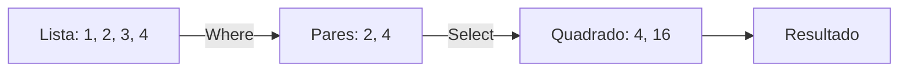

# Aula 12 - Ecossistema C# e .NET 🔷

---

## Agenda 📅

1.  O Que é .NET?
2.  Ferramentas (VS vs VS Code)
3.  C# Básico
4.  LINQ (A Mágica)
5.  F# (O Lado Funcional)

---

## 1. O Que é .NET? 🏗️

- **C#**: A Linguagem.
- **.NET**: A Plataforma (Runtime, Bibliotecas).
- Criado pela Microsoft para bater de frente com o Java.
- Hoje é **Open Source** e roda no Linux/Mac.

---

## 2. Ferramentas 🛠️

Onde programar?

- **Visual Studio (Roxo)**: A IDE completa. Pesada. Faz tudo (Arrastar botões, Banco de Dados).
- **VS Code (Azul)**: Editor leve. Rápido. Exige instalar extensões.

---

### Criando um Projeto 💻

No terminal:

1.  `dotnet new console -o MeuApp`
2.  `cd MeuApp`
3.  `code .`
4.  `dotnet run`

---

## 3. C# Básico 📝

Muito parecido com Java.

```csharp
using System;

class Program {
    static void Main() {
        Console.WriteLine("Olá, C#!");
        // Em Java seria System.out.println
    }
}
```

---

## 4. LINQ: A Joia da Coroa 💎

**L**anguage **In**tegrated **Q**uery.

- Tratar listas como se fossem SQL.
- Filtrar, Ordenar, Transformar dados em **uma linha**.

---

### Sem LINQ (Jeito Velho) 👴

```csharp
List<int> pares = new List<int>();
foreach (int n in numeros) {
    if (n % 2 == 0) {
        pares.Add(n);
    }
}
```

---

### Com LINQ (Jeito Novo) ✨

```csharp
var pares = numeros.Where(n => n % 2 == 0).ToList();
```

> Muito mais limpo e legível!

---

### Visualizando LINQ (Mermaid)



---

## Tipos de Dados Poderosos 💪

- **var**: O compilador adivinha o tipo.
    - `var x = 10;` (Vira int).
- **Nullable Types**:
    - `int? idade = null;` (Pode ser nulo).
    - Evita erros de memória.

---

## 5. F# (Bônus) 🟣

- Linguagem **Funcional** do .NET.
- Focada em Matemática e Dados.
- Influenciou o LINQ e as Lambdas do C#.
- Código muito conciso.

---

## Exercício Rápido ⚡

**LINQ na Prática**

Dada uma lista de preços: `[10.5, 20.0, 5.0, 100.0]`

1.  Filtre os preços maiores que 15.0.
2.  Ordene do maior para o menor.
3.  Mostre o resultado.

---

## Resumo ✅

- C# é moderno, forte e produtivo.
- **.NET** roda em tudo.
- **LINQ** salva vidas (e linhas de código).
- Visual Studio é a casa do C#.

---

## Próxima Aula 🚀

- Vamos sair das linguagens compiladas.
- Vamos para a linguagem mais popular da Ciência de Dados.
- **Python**: Simples, poderoso e lento (mas ninguém liga).

👉 **Tarefa**: Instalar o .NET SDK!