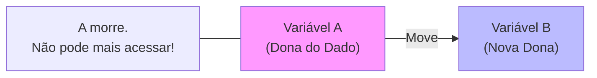
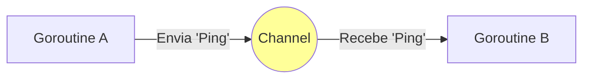

# Aula 14 - Sistemas Modernos: Rust e Go 🦀🐹

---

## Agenda 📅

1.  O Problema do C/C++
2.  Rust: Segurança de Memória
3.  Go: Concorrência Simples
4.  Comparativo
5.  Quando usar?

---

## 1. O Problema do C/C++ 💥

- C/C++ são rápidos, mas perigosos.
- **70% das vulnerabilidades** de segurança são erros de memória (Microsoft).
- Buffer Overflow, Use-After-Free.

---

## 2. Rust 🦀

- Criada pela Mozilla.
- Promessa: **Performance de C++ com Segurança de Memória**.
- Sem Garbage Collector (GC).
- Sem Tela Azul.

---

### O Segredo: Ownership (Posse) 🔑

- Cada dado tem **um único dono**.
- Quando o dono muda, o antigo perde o acesso.
- O compilador verifica isso **antes** de rodar.

---

### Visualizando Ownership



---

### Código Rust

```rust
fn main() {
    let a = String::from("Olá");
    let b = a; // MOVEU para b
    
    // println!("{}", a); // ERRO DE COMPILAÇÃO!
    // O compilador te salva de usar memória inválida.
}
```

---

## 3. Go (Golang) 🐹

- Criada pelo Google (Rob Pike, Ken Thompson).
- Foco: **Simplicidade** e **Google Scale**.
- Compila ultra-rápido.

---

### Concorrência Fácil (Goroutines) 🧵

- Threads são pesadas.
- Goroutines são leves (milhares em poucos MBs).
- **Channels**: Forma segura de conversar entre processos.

---

### Visualizando Channels



---

### Código Go

```go
package main
import "fmt"

func main() {
    mensagens := make(chan string)

    go func() { mensagens <- "Ping" }()

    msg := <-mensagens
    fmt.Println(msg)
}
```

---

## 4. Comparativo ⚖️

| Feature | Rust 🦀 | Go 🐹 |
| :--- | :--- | :--- |
| **Foco** | Controle, Segurança Absoluta | Simplicidade, Web Services |
| **Aprendizado** | Curva Íngreme (Dificil) | Muito Fácil |
| **Performance** | Extrema (Zero-Cost) | Muito Boa (Com GC) |
| **Uso** | Drivers, Engines, Crypto | Microservices, Cloud, APIs |

---

## Termynal: Execução 🖥️

<div data-termynal class="termy">
    <span data-ty="input">cargo run</span>
    <span data-ty="progress">Compiling...</span>
    <span data-ty>Hello Rust! (Safe)</span>
    <span data-ty="input">go run main.go</span>
    <span data-ty>Hello Go! (Fast Build)</span>
</div>

---

## Resumo ✅

- **Rust**: Substitui C++ onde segurança é crítica.
- **Go**: Substitui Java/Node onde concorrência é crítica.
- Ambas são o futuro da Infraestrutura (Docker, Kubernetes).

---

## Próxima Aula 🚀

- Sair do Servidor.
- Ir para o dispositivo que está na sua mão.
- **Desenvolvimento Mobile**: Flutter (Dart) e Nativo.

👉 **Tarefa**: Instalar o Go e rodar um "Olá Mundo"!