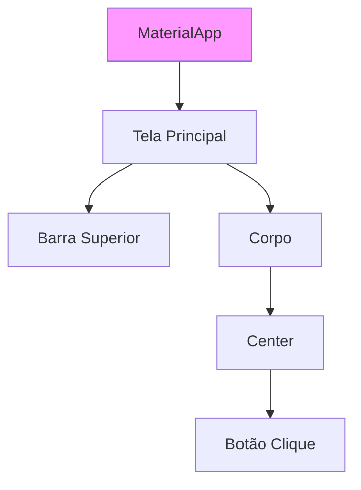
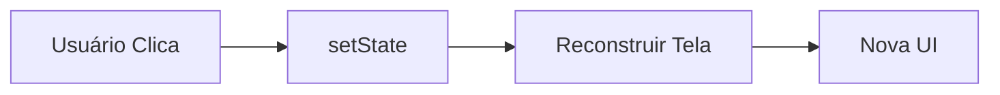

# Aula 15 - Desenvolvimento Mobile 📱

---

## Agenda 📅

1.  O Ecossistema Mobile
2.  Nativo vs Multiplataforma
3.  Dart e Flutter (Google)
4.  Árvore de Widgets
5.  Kotlin (Android Nativo)

---

## 1. O Mundo Mobile 🌍

Dois gigantes dominam o mercado.

- **Android (Google)**: ~70% do mercado mundial. Aberto. Baseado em Linux/Java.
- **iOS (Apple)**: ~29% do mercado. Fechado. Hardware Premium.

---

## 2. Abordagens de Desenvolvimento 🛠️

Como criar apps para eles?

1.  **Nativo**:
    - Performance Máxima.
    - Acesso total ao hardware (GPS, Bluetooth).
    - **Problema**: Precisa fazer 2 vezes (Kotlin para Android, Swift para iOS).

2.  **Multiplataforma**:
    - Escreve uma vez, roda nos dois.
    - Flutter (Dart) ou React Native (JS).
    - **Vantagem**: Velocidade de entrega.

---

## 3. Flutter e Dart 💙

- **Dart**: A linguagem (parece Java + JS).
- **Flutter**: O Kit de Ferramentas (UI Toolkit).
- Renderiza pixels direto na tela (como um jogo).

---

### Tudo é um Widget 🧱

Botão é widget. Texto é widget. Layout é widget.



---

### Código Flutter Básico

```dart
import 'package:flutter/material.dart';

void main() {
  runApp(MaterialApp(
    home: Scaffold(
      appBar: AppBar(title: Text("Meu App")),
      body: Center(child: Text("Olá Mundo!")),
    ),
  ));
}
```

---

## 4. O Estado (State) ⚡

Apps são interativos.
Se o usuário clica, a tela muda.

- **StatelessWidget**: Estático (Ícone, Texto).
- **StatefulWidget**: Dinâmico (Checkbox, Contador).

---

### Ciclo de Vida do Estado



---

## 5. Kotlin (Android Nativo) 🤖

Para quando você precisa de poder bruto.

- Oficial do Google.
- 100% Compatível com Java.
- Conciso e seguro (sem NullPointerException).

```kotlin
fun main() {
    val nome = "Android"
    println("Olá, $nome!")
}
```

---

## Termynal: Criando App 📱

<div data-termynal class="termy">
    <span data-ty="input">flutter create meu_app</span>
    <span data-ty="progress">Criando arquivos...</span>
    <span data-ty="input">flutter run</span>
    <span data-ty="progress">Compilando APK...</span>
    <span data-ty>App rodando no Emulador!</span>
</div>

---

## Resumo ✅

- **Nativo**: Melhor performance, mais trabalho.
- **Multiplataforma**: Menor custo, velocidade.
- **Flutter**: Desenha a tela do zero.
- **Widgets**: Blocos de construção.

---

## Próxima Aula 🚀

- Sair do Cliente (Celular).
- Voltar para o Servidor (Backend).
- A tecnologia que roda 77% da Web.
- **PHP e Arquitetura MVC**.

👉 **Tarefa**: Rodar o "Counter App" do Flutter!