# Aula 01 - Lógica de Programação 🧠

---

## Agenda 📅

1.  O que é Lógica? <!-- .element: class="fragment" -->
2.  O Algoritmo <!-- .element: class="fragment" -->
3.  Pensamento Computacional <!-- .element: class="fragment" -->
4.  Fluxogramas <!-- .element: class="fragment" -->
5.  Seu Primeiro Algoritmo <!-- .element: class="fragment" -->

---

## 1. O que é Lógica? 🤔

Lógica é a arte de **pensar corretamente**.

- No dia a dia: "Se está chovendo, levo o guarda-chuva". <!-- .element: class="fragment" -->
- Na programação: É a sequência coerente de instruções. <!-- .element: class="fragment" -->
- **Objetivo**: Resolver problemas de forma eficaz. <!-- .element: class="fragment" -->

---

## 2. O Algoritmo 📜

Um algoritmo é uma **receita de bolo** para o computador.

- Sequência finita de passos. <!-- .element: class="fragment" -->
- Não pode ter ambiguidade. <!-- .element: class="fragment" -->
- Segue uma ordem lógica (Início -> Meio -> Fim). <!-- .element: class="fragment" -->

---

### Exemplo: Trocar uma Lâmpada 💡

1.  Pegar a escada. <!-- .element: class="fragment" -->
2.  Posicionar a escada sob a lâmpada. <!-- .element: class="fragment" -->
3.  Subir na escada. <!-- .element: class="fragment" -->
4.  Retirar a lâmpada queimada. <!-- .element: class="fragment" -->
5.  Colocar a lâmpada nova. <!-- .element: class="fragment" -->
6.  Descer da escada. <!-- .element: class="fragment" -->

---

## 3. Pensamento Computacional 💻

Dividido em 4 pilares:

1.  **Decomposição**: Quebrar o problema em partes menores. <!-- .element: class="fragment" -->
2.  **Padrões**: Identificar o que se repete. <!-- .element: class="fragment" -->
3.  **Abstração**: Focar no que é importante. <!-- .element: class="fragment" -->
4.  **Algoritmos**: Criar os passos para resolver. <!-- .element: class="fragment" -->

---

## 4. Fluxogramas 🔀

Representação visual do algoritmo.

- **Início/Fim**: Oval. <!-- .element: class="fragment" -->
- **Ação/Processo**: Retângulo. <!-- .element: class="fragment" -->
- **Decisão**: Losango. <!-- .element: class="fragment" -->

---

### Visualizando um Fluxograma

```mermaid
graph TD;
    A([Início]) --> B[Acordar];
    B --> C{Está com sono?};
    C -- Sim --> D[Dormir mais 5 min];
    D --> B;
    C -- Não --> E[Levantar];
    E --> F([Fim]);
```



---

## 5. Prática: Portugol 🇧🇷

Linguagem intermediária para aprender.

```visualg
Algoritmo "HelloWorld"
Inicio
   escreva("Olá, Lógica!")
Fimalgoritmo
```

> Simples, direto e em Português!

---

## Resumo ✅

- Lógica = Pensar com ordem. <!-- .element: class="fragment" -->
- Algoritmo = Receita de passos. <!-- .element: class="fragment" -->
- Fluxograma = Desenho da solução. <!-- .element: class="fragment" -->

---

## Próxima Aula 🚀

- **Ambiente e Ferramentas**: Como instalar o VisualG e o VS Code. <!-- .element: class="fragment" -->
- O Ciclo de Vida do Software. <!-- .element: class="fragment" -->

👉 **Dica**: Tente listar os passos de como você faz um café!