# Título da Aula (Ex: Aula 01 - Introdução) 🧩

!!! tip "Objetivo"
    **Objetivo**: Uma frase curta explicando o que o aluno vai aprender hoje.

---

## 1. Conceito: O que é X? 💡

Explicação teórica curta e direta. Use negrito para **palavras-chave**.

!!! note "Conceito Chave"
    **Conceito Chave**: Definição formal se necessário.

### Visualizando o Conceito (Mermaid)
Toda aula deve ter pelo menos um diagrama.

```mermaid
graph TD;
    A[Início] --> B{Decisão};
    B -- Sim --> C[Ação 1];
    B -- Não --> D[Ação 2];
```



---

## 2. Na Prática: Como funciona? 💻

Exemplo prático de código ou lógica.

### Exemplo em Pseudocódigo (ou Linguagem X)

```c
// Código comentado explicativo
inteiro idade = 18;
se (idade >= 18) {
    escreva("Maior de idade");
}
```

### Simulando a Execução (Termynal)

Mostre como seria a saída no terminal.

```console
$ ./programa_exemplo
Digite sua idade: 18
> Maior de idade
```

---

## 3. Aprofundando 🚀

Detalhes técnicos, memória, ou variações.

*   Ponto 1
*   Ponto 2
*   Ponto 3

!!! warning "Erro Comum"
    **Erro Comum**: O que o aluno costuma errar aqui?

---

## 4. Exercícios de Fixação 📝

1.  **Fácil**: Enunciado curto.
2.  **Médio**: Enunciado.
3.  **Desafio**: Algo para pensar.

!!! success "Mini-Projeto"
    **Mini-Projeto**: Uma ideia rápida de aplicação prática.

---
**Próxima Aula**: [Link para a próxima aula](./aula-XX.md)