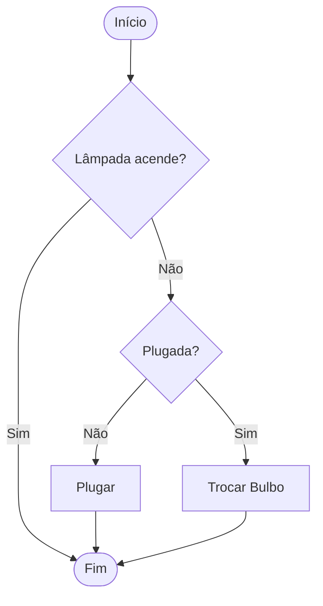

# Aula 01 - Lógica de Programação 🧠

---

## Agenda 📅

1.  O que é Lógica?
2.  O Algoritmo
3.  Pensamento Computacional
4.  Fluxogramas
5.  Ferramentas (VisualG)

---

## 1. O que é Lógica? 🧠

> "A arte de pensar corretamente."

- Organização de ideias.
- Maneira rigorosa de raciocinar.
- **Não** é apenas para computadores!
- Usamos no dia a dia sem perceber.

---

## Lógica no Dia a Dia ☀️

- Se **chover**, levo guarda-chuva.
- Se **estiver sol**, vou à praia.
- Se o **pneu furar**, troco o pneu.
- **Causa** -> **Efeito**.

---

## O Computador é BURRO 🤖

- Ele não "pensa".
- Ele apenas obedece.
- Se você explicar errado, ele fará errado.
- **Programar** = Ensinar o computador.

---

## 2. O Algoritmo 💡

- **Definição**: Sequência de passos finitos e precisos para resolver um problema.
- **Palavras-chave**:
    - **Sequência**: A ordem importa.
    - **Finitos**: Tem que acabar.
    - **Precisos**: Sem "talvez".

---

## Receita de Bolo 🍰

1.  Quebrar ovos.
2.  Misturar farinha.
3.  Assar por 40min.
4.  Comer.

*Se você "Comer" antes de "Assar", vai dar dor de barriga! (Ordem importa)*

---

## Estrutura Básica 🏗️

Todo algoritmo tem 3 fases:

1.  **Entrada** (Ingredientes).
2.  **Processamento** (Misturar/Assar).
3.  **Saída** (Bolo pronto).

---

## 3. Pensamento Computacional 🧩

Os 4 Superpoderes para resolver problemas complexos.

1.  **Decomposição**
2.  **Reconhecimento de Padrões**
3.  **Abstração**
4.  **Algoritmo**

---

### 3.1 Decomposição 🧱

- Quebrar um problema grande em menores.
- Exemplo: **Construir uma Casa**.
    - Fazer fundação.
    - Levantar paredes.
    - Colocar telhado.

---

### 3.2 Reconhecimento de Padrões 🔍

- Identificar o que já vimos antes.
- Exemplo:
    - Dirigir Carro 🚗
    - Dirigir Caminhão 🚛
    - Padrão: Volante, Pedais, Câmbio.

---

### 3.3 Abstração 🌫️

- Focar no essencial.
- Ignorar detalhes irrelevantes.
- Exemplo: "Trocar o pneu".
    - Importa: Chave de roda, Macaco.
    - Não importa: Marca da borracha, cor do aro.

---

### 3.4 Algoritmo (Design) 📝

- Escrever o passo a passo final.
- Juntar tudo o que foi planejado.
- O plano de execução.

---

## 4. Fluxogramas 🗺️

A linguagem universal dos programadores.

- Desenho > Texto.
- Padronizado mundialmente.

---

### Símbolos Principais

| Forma | Nome | Função |
| :---: | :--- | :--- |
| `([ ... ])` | **Terminador** | Início/Fim |
| `[ ... ]` | **Processo** | Ação/Cálculo |
| `/ ... /` | **Dados** | Entrada/Saída |
| `{ ... }` | **Decisão** | Pergunta (Sim/Não) |

---

### Exemplo: Lâmpada 💡



---

## 5. VisualG e Portugol 💻

- **Portugol**: "Português Estruturado".
- Uma linguagem feita para **aprender**.
- Comandos em português.
- Foco na lógica, não na sintaxe complexa (ainda).

---

### Ferramenta: VisualG

- Gratuito.
- Leve.
- Roda direto no Windows.
- Mostra a memória do computador.

---

### Primeiro Código (Preview)

```visualg
Algoritmo "OlaMundo"
Inicio
   Escreval("Olá, Mundo!")
   Escreval("Eu sou um programador!")
FimAlgoritmo
```

> Veremos isso na prática na próxima aula!

---

## Vamos Praticar? 📝

**Desafio do Lobo/Ovelha/Alface**

- Um barqueiro.
- Lobo come Ovelha.
- Ovelha come Alface.
- Barco só leva 1 passageiro extra.
- Como atravessar todos?

---

## Solução (Algoritmo)

1.  Leva Ovelha. Voltou Vazio.
2.  Leva Lobo. Traz Ovelha.
3.  Deixa Ovelha. Leva Alface. Voltou Vazio.
4.  Leva Ovelha.
5.  FIM.

---

## Resumo ✅

- Lógica = Pensar certo.
- Algoritmo = Sequência de passos.
- 3 Fases: Entrada, Processamento, Saída.
- Fluxogramas ajudam a desenhar a solução.

---

## Próxima Aula 🚀

- Configurar o VisualG.
- Entender **Variáveis** (As caixas da memória).
- Tipos de Dados (Texto, Número, Lógico).

👉 **Instalem o VisualG!**