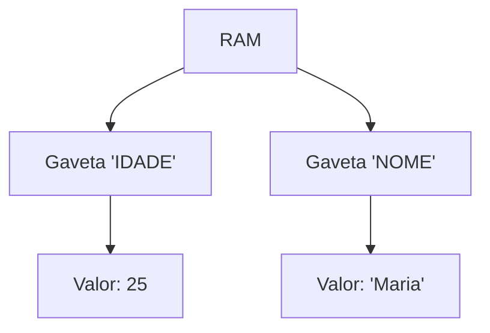

# Aula 03 - Estrutura Sequencial ➡️

---

## Agenda 📅

1.  Variáveis (Revisão)
2.  Tipos de Dados
3.  Entrada e Saída
4.  Operadores Aritméticos
5.  Atribuição

---

## 1. Variáveis: Caixas da Memória 📦

- Computador tem memória (RAM).
- **Variável**: Um pedaço nomeado dessa memória.
- Guardam **um valor** por vez.

---

### Visualização 🧪



---

## 2. Tipos de Dados 📐

Nem tudo cabe na mesma caixa.

1.  **Inteiro**: Números sem vírgula (10, -5).
2.  **Real**: Números com vírgula (10.5, 3.14).
3.  **Caractere**: Texto ("Olá", "A").
4.  **Lógico**: Verdadeiro ou Falso.

---

### Erro Comum ❌

Tentar colocar texto numa caixa de número.

```visualg
Var
   idade : inteiro
Inicio
   idade <- "Vinte" // ERRO!
```

---

## 3. Entrada e Saída ⚙️

Como o programa fala com o usuário?

- **Entrada**: Dados que entram (Teclado).
- **Saída**: Dados que saem (Tela).

---

### Comando: ESCREVA (Saída) 📤

- Mostra texto na tela.
- `escreva` (na mesma linha).
- `escreval` (pula linha).

```visualg
escreval("Olá Mundo")
escreva("Tudo bem?")
```

---

### Comando: LEIA (Entrada) 📥

- Pára o programa e espera o usuário digitar.
- Guarda o que foi digitado numa variável.

```visualg
escreva("Qual seu nome?")
leia(nome)
```

---

## 4. Atribuição (`<-`) ⬅️

- Colocar um valor dentro da variável.
- Lê-se: "Recebe".
- A seta sempre aponta para a esquerda (para a variável).

```visualg
media <- (n1 + n2) / 2
nome <- "João"
```

---

## 5. Operadores Aritméticos 🧮

O computador é uma calculadora gigante.

| Operador | Nome | Exemplo |
| :---: | :--- | :--- |
| `+` | Soma | `5 + 3` |
| `-` | Subtração | `10 - 2` |
| `*` | Multiplicação | `4 * 3` |
| `/` | Divisão | `20 / 4` |

---

### Operadores Especiais ✨

- **Módulo (`%`)**: Resto da divisão.
    - `5 % 2 = 1` (Sobrou 1).
    - Útil para saber se é Par ou Ímpar.
- **Potência (`^`)**: Elevar ao quadrado/cubo.
    - `2 ^ 3 = 8`.

---

## Ordem de Precedência 🥇

Matemática básica!

1.  Parênteses `( )`
2.  Potência `^`
3.  Multiplicação e Divisão `* /`
4.  Soma e Subtração `+ -`

> `2 + 3 * 4` = 14 (Não 20!)

---

## Exemplo Completo: Dobro do Número 🔢

Vamos criar um programa que lê um número e mostra o dobro.

---

### Passo 1: Definir Variáveis

```visualg
Algoritmo "Dobro"
Var
   numero : inteiro
   resultado : inteiro
```

---

### Passo 2: Entrada

```visualg
Inicio
   escreva("Digite um número: ")
   leia(numero)
```

---

### Passo 3: Processamento

```visualg
   resultado <- numero * 2
```

---

### Passo 4: Saída

```visualg
   escreval("O dobro é: ", resultado)
Fimalgoritmo
```

---

## Exercício Rápido ⚡

Faça no VisualG agora:
1.  Leia dois números.
2.  Some os dois.
3.  Mostre o resultado.

---

## Resumo ✅

- **Variáveis**: Nome, Tipo e Valor.
- **Tipos**: Inteiro, Real, Caractere, Lógico.
- **Entrada**: `leia()`.
- **Saída**: `escreva()`.
- **Atribuição**: `<-`.

---

## Próxima Aula 🚀

- E se precisarmos tomar **decisões**?
- O comando `SE`.
- Estruturas Condicionais.

👉 **Tarefa**: Terminar os exercícios da lista 03!