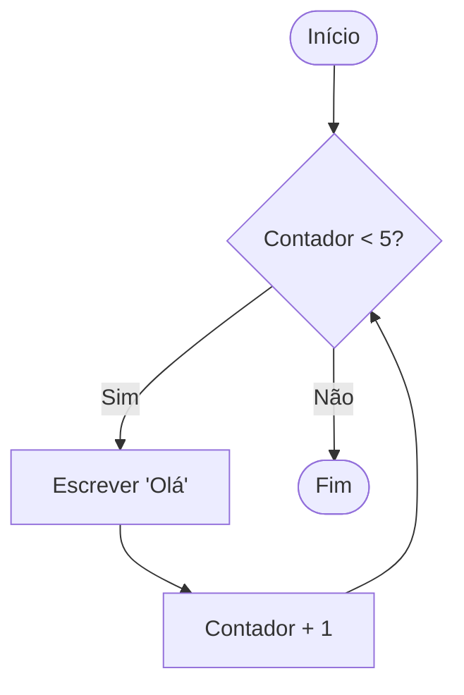

# Aula 05 - Estruturas Repetitivas 🔁

---

## Agenda 📅

1.  O Poder da Repetição (Loops)
2.  Estrutura Enquanto (While)
3.  Estrutura Repita (Do-While)
4.  Estrutura Para (For)
5.  Controle de Fluxo (Interrompa)
6.  Teste de Mesa

---

## 1. O Poder da Repetição 🔄

Imagine escrever "Eu não vou jogar bolinha de papel" 100 vezes no quadro.

- **Humano**: Cansa, erra, demora.
- **Computador**: Faz em 1 milissegundo.

---

### O Loop (Laço) ♾️

- Executa um bloco de código **enquanto** uma condição for verdadeira.
- Automatiza tarefas repetitivas.
- Economiza linhas de código.

---

### Visualizando um Loop



---

## 2. Enquanto (While) ⏳

- O mais comum.
- Testa a condição **ANTES** de entrar.
- Se a condição for falsa de cara, ele nunca executa.

---

### Sintaxe

```visualg
enquanto (condicao) faca
   // Comandos
fimenquanto
```

---

### Exemplo: Contagem

```visualg
i <- 0
enquanto (i < 5) faca
   escreval("Número: ", i)
   i <- i + 1  // Importante!
fimenquanto
```

> Se esquecer o `i <- i + 1`, vira um **Loop Infinito**! 😱

---

## 3. Repita-Até (Do-While) 🛡️

- Testa a condição no **FINAL**.
- Executa **pelo menos uma vez**.
- Ótimo para menus ou validação.

---

### Sintaxe

```visualg
repita
   // Comandos
ate (condicao)
```

**Atenção**: No VisualG/Portugol, ele repete *até* a condição ser verdadeira (ou seja, enquanto for falsa). Em outras linguagens (C, Java), é *enquanto* for verdadeira.

---

### Exemplo: Senha Correta 🔒

```visualg
repita
   escreva("Digite a senha: ")
   leia(senha)
ate (senha == "1234")
```

---

## 4. Para (For) 🎯

- Quando sabemos **exatamente** quantas vezes repetir.
- Agrupa tudo numa linha só:
    1.  **Início** (Onde começa)
    2.  **Fim** (Onde termina)
    3.  **Passo** (De quanto em quanto)

---

### Sintaxe

```visualg
para i de 1 ate 10 passo 1 faca
   escreva(i)
fimpara
```

- **i**: Variável contadora.
- **1**: Valor inicial.
- **10**: Valor final.
- **1**: Incremento.

---

### Exemplo: Contagem Regressiva 🚀

```visualg
para i de 10 ate 0 passo -1 faca
   escreval(i)
fimpara
escreval("FOGO!")
```

---

## 5. Controle de Fluxo (Interrompa) 🛑

- Sai do loop imediatamente.
- Útil para parar buscas ou sair de menus.

```visualg
enquanto (verdadeiro) faca
   se (botao == "Sair") entao
      interrompa
   fimse
fimenquanto
```

---

## 6. O Teste de Mesa 🧠

Como debugar mentalmente?

1.  Crie uma tabela com as variáveis.
2.  Simule linha por linha.
3.  Anote as mudanças.

| Passo | i | Saída |
| :--- | :--- | :--- |
| 1 | 0 | - |
| 2 | 0 | "0" |
| 3 | 1 | - |
| ... | ... | ... |

---

## Comparativo ⚖️

| Estrutura | Quando usar? |
| :--- | :--- |
| **Enquanto** | Não sei quantas vezes vai repetir. |
| **Repita** | Tenho que executar pelo menos 1 vez. |
| **Para** | Sei exatamente o número de repetições. |

---

## Exercício Rápido ⚡

**Tabuada do 7**

1.  Use um `para`.
2.  De 1 até 10.
3.  Mostre `7 x i = resultado`.

---

## Resumo ✅

- **Loops** economizam tempo.
- **Cuidado** com Loops Infinitos.
- Escolha a estrutura certa para o problema.

---

## Próxima Aula 🚀

- E para guardar 50 notas de alunos?
- Criar 50 variáveis? `n1, n2, n3...`? 😫
- **Vetores (Arrays)**: A solução elegante.

👉 **Tarefa**: Fazer a Tabuada e o Primo!