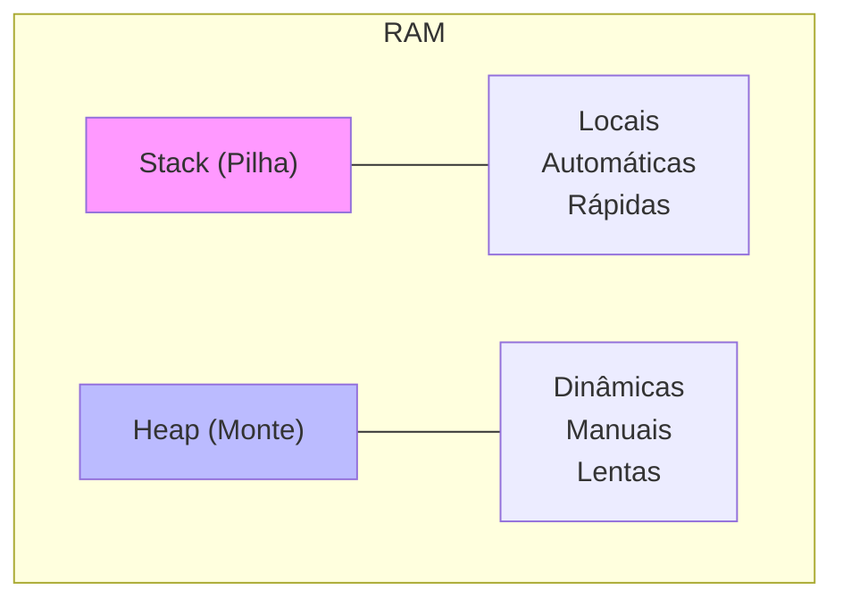

# Aula 09 - C e C++: Baixo Nível 🧱

---

## Agenda 📅

1.  História e Importância
2.  Anatomia de um Programa C
3.  Compilação
4.  Gerenciamento de Memória (Stack vs Heap)
5.  Ponteiros
6.  Introdução ao C++ (OOP)

---

## 1. O Pai das Linguagens 👴

- **C (1972)**: Dennis Ritchie (Bell Labs).
- **Base de Tudo**: Windows, Linux, Mac, Android, iOS.
- **Filosofia**: "Confie no programador" (mesmo se ele fizer besteira).

---

### Por que aprender C hoje? 🧐

- Entender como a máquina funciona de verdade.
- Gerenciar memória manualmente.
- Performance extrema (Jogos, Sistemas Embarcados).

---

## 2. Anatomia Básica 🦴

```c
#include <stdio.h>

int main() {
    printf("Olá, Mundo C!");
    return 0;
}
```

---

### Desmontando o Código 🔧

1.  `#include <stdio.h>`: Importa biblioteca de IO (Entrada/Saída).
2.  `int main()`: A função principal. Todo programa começa aqui.
3.  `printf(...)`: Imprime formatado.
4.  `return 0;`: Retorna "Sucesso" para o Sistema Operacional.

---

### O Ponto e Vírgula `;`

- Em C/C++, ele é **OBRIGATÓRIO**.
- O compilador não adivinha onde a linha termina.
- Esquecer `;` é o erro nº 1 de iniciantes.

---

## 3. O Processo de Compilação ⚙️

C é uma linguagem **Compilada**.

1.  **Código Fonte** (`.c`): Texto legível.
2.  **Compilador** (`gcc`): Traduz para Assembly/Machine Code.
3.  **Linker**: Junta com bibliotecas.
4.  **Executável** (`.exe`): Programa final.

---

## 4. Memória: Stack vs Heap 🧠

Onde seus dados moram?

---

### Visualizando a Memória



---

### Stack (Pilha) 🥞

- Variáveis normais: `int idade = 20;`
- Criada e destruída automaticamente.
- Tamanho fixo e pequeno.

---

### Heap (Monte) 🏔️

- Memória dinâmica: `malloc()` ou `new`.
- Você pede memória ao sistema.
- **Cuidado**: Você precisa devolver (`free` ou `delete`), senão vaza memória (Memory Leak)!

---

## 5. Ponteiros: O Superpoder ⚡

Um ponteiro não guarda o valor. Guarda o **ENDEREÇO**.

- `int x = 10;` (Valor 10)
- `int *p = &x;` (Endereço onde o 10 mora, ex: `0x7ffee4`)

---

### Para que serve? 🤷

1.  Modificar variáveis originais dentro de funções.
2.  Alocar memória dinâmica.
3.  Criar estruturas complexas (Listas, Árvores).

> "Com grandes poderes vêm grandes responsabilidades." (E Segmentation Faults).

---

## 6. Introdução ao C++ 🚀

C++ = C + Classes (OOP).

- Mantém a performance do C.
- Adiciona organização de objetos.
- Base para Jogos (Unreal) e Softwares Pesados (Chrome, Photoshop).

---

### Exemplo C++ 🚗

```cpp
#include <iostream>
using namespace std;

class Carro {
public:
    void buzinar() {
        cout << "Bi Bi!" << endl;
    }
};

int main() {
    Carro meuCarro;
    meuCarro.buzinar();
    return 0;
}
```

---

### Diferenças C vs C++

| Feature | C | C++ |
| :--- | :--- | :--- |
| **Paradigma** | Estruturado | Orientado a Objetos (Multi) |
| **Output** | `printf()` | `cout <<` |
| **Input** | `scanf()` | `cin >>` |
| **Extensão** | `.c` | `.cpp` |

---

## Termynal: Compilando 🖥️

<div data-termynal class="termy">
    <span data-ty="input">gcc programa.c -o programa</span>
    <span data-ty="progress">Compilando...</span>
    <span data-ty="input">./programa</span>
    <span data-ty>Olá Mundo C!</span>
</div>

---

## Resumo ✅

- C é a mãe de todas.
- **Compilador** traduz para binário.
- **Ponteiros** acessam memória direta.
- **C++** adiciona Classes ao poder do C.

---

## Próxima Aula 🚀

- Sair do "Baixo Nível".
- Ir para o mundo corporativo e robusto.
- **Java**: "Escreva uma vez, rode em qualquer lugar".

👉 **Tarefa**: Instalar o Code::Blocks ou configurar GCC no VS Code!